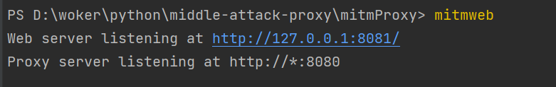

具体文档 ： https://ptorch.com/docs/10/mitmproxy_overview_installation


MitmProxy启动有三个命令（三种模式）

mitmproxy，提供命令行界面
mitmdump，提供一个简单的终端输出（还可以配合Python抓包改包）
mitmweb，提供在线浏览器抓包界面

mitmdump启动


windows 安装过程中出现的BUG 

1.pip install mitmproxy

mitmproxy --version
```angular2html
Error: mitmproxy's console interface is not supported on Windows. You can run mitmdump or mitmweb instead.

```
没办法 不带Windows 玩 只能用  mitmdump or mitmweb 

控制台 输入 ：  mitmweb

```angular2html
ImportError: cannot import name 'soft_unicode' from 'markupsafe' (d:\.pyenv\pyenv-win\versions\3.7.2\lib\site-packages\markupsafe\__init__.py)

```

控制台输入 ：  mitmdump --version

```angular2html
ImportError: cannot import name 'soft_unicode' from 'markupsafe' (d:\.pyenv\pyenv-win\versions\3.7.2\lib\site-packages\markupsafe\__init__.py)

```

解决办法 ： 

pip show markupsafe

```angular2html
Name: MarkupSafe
Version: 2.1.1
Summary: Safely add untrusted strings to HTML/XML markup.
Home-page: https://palletsprojects.com/p/markupsafe/
Author: Armin Ronacher
Author-email: armin.ronacher@active-4.com
License: BSD-3-Clause

```
指定版本安装 ： pip install markupsafe==2.0.1


再试下 ：  mitmdump --version 





貌似功能已经可以用了

证书安装下 

用火狐 不用设置电脑的系统代理，很方便 


直接开启mitmweb 设置好代理、证书就可以看到请求了 

脚本拦截代理 操作 
mitmdump -s .\demo.py

